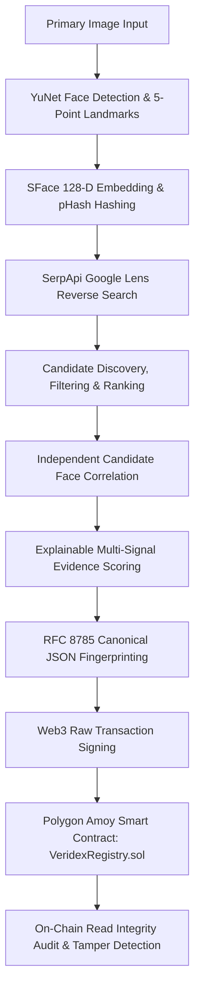

# VERIDEX — Visual Evidence Verification Engine

> **Zero-Trust Visual Evidence Forensic Verification Engine**  
> *Discover. Correlate. Verify. Anchor.*

[](https://github.com/DropOutsCore/VeriDex_hhgt3)
[](https://amoy.polygonscan.com/address/0xA7F56AE142C114fCA9bC0386CdD693e665ADF101)
[](https://fastapi.tiangolo.com)
[](https://react.dev)
[](https://soliditylang.org)
[](https://opencv.org)

---

## 1. Project Name
**VERIDEX** — Visual Evidence Verification Engine

---

## 2. Problem Statement
In an era dominated by synthetic media, deepfakes, and online visual misattribution, authenticating visual evidence is a critical forensic challenge.
Existing reverse image search platforms suffer from three major vulnerabilities:
1. **Blind Reverse Search Trust**: Search engines index matching visual assets across web and social media, but fail to perform biometric face correlation to verify whether discovered candidates match the target individual.
2. **Centralized & Fragile Logs**: Verification audit trails stored in private databases can be altered, backdated, or deleted by database administrators.
3. **Opaque Black-Box Scoring**: Tools output generic percentage scores without explaining individual signal contributions or establishing cryptographic tamper resistance.

---

## 3. What VERIDEX Does
VERIDEX bridges computer vision biometrics, genuine web/social discovery, transparent multi-signal evidence scoring, and Web3 blockchain anchoring into an end-to-end, zero-trust forensic verification pipeline.

VERIDEX takes an input image containing a human face, extracts facial landmarks and 128-D SFace signature embeddings, executes genuine reverse image search via Google Lens, independently downloads and correlates candidate web assets, calculates an explainable evidence correspondence score, canonicalizes the evidence package into a SHA-256 fingerprint (EVIDENCE DNA), anchors that fingerprint onto the Polygon Amoy blockchain, and provides real-time on-chain integrity verification and tamper detection.

> **Key Architectural Mandate**:  
> *"Blockchain is used as a tamper-evident integrity anchor for the cryptographic fingerprint of the discovered evidence."*

---

## 4. Architecture



---

## 5. Complete 8-Stage Pipeline

| Stage | ID | Name | Description | Technology / Standards |
|---|---|---|---|---|
| **01** | `SCAN` | **Face Scanning** | Detects human faces & 5 key landmarks (eyes, nose, mouth) | OpenCV YuNet (`cv2.FaceDetectorYN`) |
| **02** | `ENCODING` | **Face Signature** | Performs affine alignment & extracts 128-D unit embedding vector | OpenCV SFace (`cv2.FaceRecognizerSF`) |
| **03** | `SEARCHING` | **Reverse Trace** | Queries live web & social media candidates | SerpApi Google Lens Engine |
| **04** | `DISCOVERING` | **Candidate Discovery** | Normalizes, filters invalid URLs, deduplicates & ranks candidates | Domain & Platform Filtering |
| **05** | `VERIFYING` | **Correlation & Scoring** | Downloads candidate images, correlates faces & computes evidence score | SFace Cosine Similarity + pHash + Weights |
| **06** | `FINGERPRINTING` | **Evidence DNA** | Canonicalizes package & computes SHA-256 evidence fingerprint | RFC 8785 Canonical JSON + SHA-256 |
| **07** | `ANCHORING` | **Chain Anchor** | Submits Web3 raw transaction to Polygon Amoy smart contract | Web3.py + Polygon Amoy (Chain ID 80002) |
| **08** | `INTEGRITY` | **Integrity Proof** | Reads contract on-chain & compares local hash vs on-chain hash | Smart Contract View + Tamper Test Lab |

---

## 6. Face Detection & Recognition Technology
- **Face Detector**: OpenCV YuNet ONNX model (`face_detection_yunet_2023mar.onnx`).
  - Input: BGR Image matrix or binary image stream.
  - Output: Bounding box coordinates `[x, y, w, h]`, detection confidence score, and 5 key facial landmarks (right eye, left eye, nose tip, right mouth corner, left mouth corner).
- **Face Signature Recognizer**: OpenCV SFace ONNX model (`face_recognition_sface_2021dec.onnx`).
  - Facial Alignment: `sface.alignCrop(image, face_landmarks)` applies affine transformation mapping landmarks to a canonical 112x112 pixel crop.
  - Feature Vector: 128-dimensional floating-point embedding vector, L2-unit normalized (`||v|| = 1.0`).
- **Face Similarity Metric**: Cosine Similarity between 128-D normalized embeddings:
  $$\text{Cosine Similarity}(A, B) = A \cdot B$$
  Decision boundary threshold: `0.3633` (Standard SFace threshold).

---

## 7. Reverse-Search Technology
- **Search Provider**: SerpApi Google Lens Engine (`engine="google_lens"`).
- **Genuine Execution**: Sends image bytes or public image URL to SerpApi endpoints.
- **No Mocking**: Does NOT use pre-selected URLs, fake candidate data, or hardcoded social media profiles. Returns authentic live search engine results.
- **Resilience & Error Handling**: Gracefully handles missing API keys, HTTP 401 authentication errors, HTTP 429 rate limits, request timeouts, and empty search responses.

---

## 8. Candidate Correlation Methodology
- **Independent Asset Acquisition**: Candidate URLs returned by search are downloaded independently via `httpx` with SSRF protection safeguards.
- **Multi-Face Scene Handling**: Candidate images with group photos or multiple faces are scanned with YuNet; all candidate faces are extracted and evaluated against target input face signature.
- **Best Face Selection**: Selects candidate face yielding maximum Cosine Similarity score.
- **Classification Categories**:
  - `DISCOVERED`: Discovered by search engine.
  - `CORRELATED`: Candidate image contains faces evaluated against target input face.
  - `VERIFIED`: High face similarity + evidence correspondence confirmed.

---

## 9. Multi-Signal Evidence Scoring
VERIDEX computes a transparent, weighted **Evidence Correspondence Score** ($S \in [0.0, 1.0]$):

$$S = (w_{\text{rev}} \cdot S_{\text{rev}}) + (w_{\text{face}} \cdot S_{\text{face}}) + (w_{\text{img}} \cdot S_{\text{img}}) + (w_{\text{src}} \cdot S_{\text{src}}) + (w_{\text{meta}} \cdot S_{\text{meta}})$$

### Default Configured Weights:
- **$w_{\text{rev}} = 0.40$**: Reverse Search Engine Match Rank & Relevance.
- **$w_{\text{face}} = 0.35$**: OpenCV SFace Cosine Similarity Score.
- **$w_{\text{img}} = 0.10$**: Perceptual pHash DCT Scene Image Similarity.
- **$w_{\text{src}} = 0.10$**: Publisher Domain & Platform Relevance.
- **$w_{\text{meta}} = 0.05$**: EXIF & Contextual Metadata Consistency.

> **Language & Terminology Note**: The output is explicitly called an **Evidence Correspondence Score**. It measures multi-signal alignment across independent channels, and is NEVER presented as an "absolute proof of legal identity".

---

## 10. Hash & Fingerprint Generation (EVIDENCE DNA)
- **Deterministic Evidence Package**: Combines primary image SHA-256, primary pHash, face embedding hash, matched URL, matched image SHA-256, matched pHash, similarity scores, timestamp, and record ID.
- **RFC 8785 Canonical Serialization**:
  1. Lexicographical key sorting (`sort_keys=True`).
  2. Structural whitespace elimination (`separators=(',', ':')`).
  3. Float precision normalization (rounded to 4 decimal places).
  4. ASCII character encoding (`ensure_ascii=True`).
- **VERIDEX Fingerprint**: `SHA-256(canonical_json_bytes)` yields a 64-character hex digest.

---

## 11. Blockchain Used
- **Blockchain**: Polygon Amoy Testnet
- **Standard**: Ethereum Virtual Machine (EVM) compatible raw Web3 transactions.

---

## 12. Network and Chain ID
- **Network Name**: Polygon Amoy Testnet
- **Chain ID**: `80002`
- **Default RPC URL**: `https://polygon-amoy-bor-rpc.publicnode.com`

---

## 13. Smart Contract
- **Contract Name**: `VeridexRegistry.sol`
- **Deployed Contract Address**: [`0xA7F56AE142C114fCA9bC0386CdD693e665ADF101`](https://amoy.polygonscan.com/address/0xA7F56AE142C114fCA9bC0386CdD693e665ADF101)
- **Explorer Link**: [PolygonScan Amoy Contract Details](https://amoy.polygonscan.com/address/0xA7F56AE142C114fCA9bC0386CdD693e665ADF101)

---

## 14. Environment Variables
Create `.env` file in the project root directory:

```env
# Reverse Image Search Configuration (SerpApi)
SERPAPI_API_KEY=your_serpapi_key_here

# Blockchain Configuration (Polygon Amoy Testnet)
POLYGON_RPC_URL=https://polygon-amoy-bor-rpc.publicnode.com
PRIVATE_KEY=your_polygon_amoy_private_key_here
CONTRACT_ADDRESS=0xA7F56AE142C114fCA9bC0386CdD693e665ADF101
POLYGON_CHAIN_ID=80002
```

---

## 15. Installation

### Prerequisites
- Python 3.11+
- Node.js 18+ and npm
- OpenCV dependencies (`opencv-python`)

### Clone & Install Dependencies
```bash
git clone https://github.com/DropOutsCore/VeriDex_hhgt3.git
cd VeriDex_hhgt3

# Backend Setup
cd backend
python -m venv .venv
# Activate virtual environment:
# Windows PowerShell:
.\.venv\Scripts\Activate.ps1
# Linux / macOS:
# source .venv/bin/activate

pip install -r requirements.txt
python -m scripts.download_models

# Frontend Setup
cd ../frontend
npm install
```

---

## 16. How to Run

### 1. Start Backend FastAPI Server
```bash
cd backend
# With virtual environment active:
python -m uvicorn app.main:app --host 127.0.0.1 --port 8000 --reload
```
API documentation available at `http://127.0.0.1:8000/docs`.

### 2. Start Frontend Vite Dev Server
```bash
cd frontend
npm run dev
```
Open `http://localhost:5173` in your browser.

---

## 17. End-to-End Usage
1. Open the VERIDEX Web Application (`http://localhost:5173`).
2. Upload a target evidence image in **Stage 01 SCAN**.
3. View 5-point facial landmark alignment and 128-D SFace embedding extraction in **Stage 02 FACE SIGNATURE**.
4. Inspect discovered candidate web sources in **Stage 03 REVERSE TRACE**.
5. Analyze dual-exhibit face correlation in **Stage 04 CORRELATION**.
6. Review the multi-signal score breakdown in **Stage 05 EVIDENCE SCORE**.
7. Inspect the RFC 8785 canonical JSON and SHA-256 fingerprint in **Stage 06 FINGERPRINT**.
8. Submit live transaction to Polygon Amoy in **Stage 07 CHAIN ANCHOR**.
9. Verify on-chain integrity and execute tamper tests in **Stage 08 INTEGRITY**.

---

## 18. Blockchain Verification Workflow
1. The backend recalculates the local canonical SHA-256 evidence fingerprint (`local_hash`).
2. Queries the deployed `VeridexRegistry.sol` contract directly on Polygon Amoy via Web3 (`getProof(proofId)`).
3. Extracts `on_chain_hash`.
4. Compares `local_hash` vs. `on_chain_hash`:
   - If equal: returns `status: "VERIFIED"`, `verified: true`.
   - If different: returns `status: "TAMPER_DETECTED"`, `verified: false`.

---

## 19. Tamper Test Demonstration Mode
VERIDEX includes an automated tamper laboratory:
1. Click **Simulate Evidence Tampering** in Stage 08 or the Forensic Panel.
2. The engine modifies a single evidence attribute (e.g. `matched_url` -> `https://tampered-malicious-site.com/fake.jpg`).
3. Recalculates `recomputed_local_hash`.
4. Compares `recomputed_local_hash` against the unaltered `on_chain_hash` anchored on Polygon Amoy.
5. Displays a cryptographic mismatch: **TAMPER DETECTED**.

---

## 20. Security & Privacy Considerations
- **Zero Raw PII On-Chain**: Raw binary images, 128-D raw face embedding vectors, and personal contact details are NEVER anchored on-chain.
- **Cryptographic Hashes Only**: Only 256-bit SHA-256 digests and block timestamps are written to the smart contract.
- **SSRF Safeguards**: All external candidate image downloads pass strict IP and URL safety validation.
- **Secret Isolation**: Secrets (`SERPAPI_API_KEY`, `PRIVATE_KEY`) reside exclusively in `.env` (ignored by Git).

---

## 21. Known Limitations
- Extreme facial occlusion (>50%), extreme profile tilt (>70°), or low-resolution face crops (<30x30 px) can degrade face detection confidence.
- Live Web3 transaction anchoring requires a funded Polygon Amoy testnet wallet (POL tokens for gas fees).

---

## 22. Verification Quote & License
> *"Blockchain is used as a tamper-evident integrity anchor for the cryptographic fingerprint of the discovered evidence."*

Licensed under the [MIT License](LICENSE).
