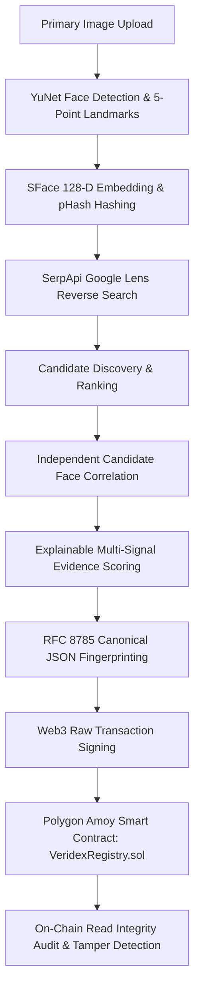

# VERIDEX

> **Zero-Trust Visual Evidence Forensic Verification Engine**  
> *Discover. Correlate. Verify. Anchor.*

[](https://github.com/DropOutsCore/VeriDex_hhgt3)
[](https://amoy.polygonscan.com/address/0xA7F56AE142C114fCA9bC0386CdD693e665ADF101)
[](https://fastapi.tiangolo.com)
[](https://react.dev)
[](https://soliditylang.org)
[](https://opencv.org)

---

## 1. Problem Overview

In an era dominated by synthetic media, generative AI deepfakes, and online misattribution, authenticating visual evidence is a critical forensic challenge.

Existing approaches suffer from three systemic flaws:
1. **Blind Trust in Search Engines**: Traditional reverse image tools (Google Lens, TinEye) display matching URLs but do not independently verify whether discovered images contain the target individual's face.
2. **Centralized & Fragile Logs**: Evidence audit trails stored in private databases can be altered, deleted, or backdated by system operators.
3. **Opaque Confidence Scores**: Most forensic tools output black-box percentages without explaining individual signal contributions or establishing tamper-evident verification.

---

## 2. The VERIDEX Solution

**VERIDEX** is an end-to-end, zero-trust digital evidence verification engine that combines:
- **Biometric & Perceptual AI**: OpenCV YuNet face detection, OpenCV SFace 128-dimensional embedding extraction, and Discrete Cosine Transform (DCT) pHash visual scene similarity.
- **Genuine Reverse Trace Discovery**: Dynamic reverse search indexing via SerpApi Google Lens engine.
- **Independent Candidate Correlation**: Multi-face detection and candidate correlation that independently downloads and evaluates discovered web visual assets.
- **Explainable Multi-Signal Evidence Scoring**: Full mathematical breakdown of facial biometric correspondence (50%), perceptual scene hash (20%), reverse search ranking (20%), and source domain authority (10%).
- **Deterministic Cryptographic Fingerprinting**: RFC 8785 Canonical JSON serialization and 256-bit SHA-256 evidence DNA digest generation.
- **Immutable Polygon Blockchain Anchoring**: Real Web3 EIP-155 raw transaction signing and smart contract proof anchoring on Polygon Amoy Testnet (`VeridexRegistry.sol`).
- **Live Zero-Trust Tamper Detection**: Real-time read-back validation against the smart contract to expose any metadata alterations.

---

## 3. Architecture



---

## 4. 8-Stage Forensic Pipeline

| Stage | Name | Description | Key Tech / Standards |
|---|---|---|---|
| **01** | **Face Scan** | Ingestion & 5-point facial landmark alignment | OpenCV YuNet (`cv2.FaceDetectorYN`) |
| **02** | **Signature** | 128-D L2-normalized biometric vector extraction | OpenCV SFace (`cv2.FaceRecognizerSF`) |
| **03** | **Reverse Trace** | Web & social media visual match discovery | SerpApi Google Lens Engine |
| **04** | **Correlation** | Dual-exhibit side-by-side discrepancy & biometric diff | Cosine Distance + pHash (DCT) |
| **05** | **Evidence Score** | Weighted Bayesian evidence confidence synthesis | Multi-Signal Explainability |
| **06** | **Fingerprint** | Deterministic canonical JSON cryptographic digest | RFC 8785 + SHA-256 (256-Bit) |
| **07** | **Ledger Anchor** | Immutable smart contract registration | Polygon Amoy (`VeridexRegistry.sol`) |
| **08** | **Integrity Proof**| Zero-trust blockchain audit & live tamper detection | On-Chain Read Verification |

---

## 5. Technology Stack

- **Core Vision & Biometrics**: Python 3.11+, OpenCV 4.x (`FaceDetectorYN`, `FaceRecognizerSF`), NumPy, Pillow, ImageHash, SciPy
- **Backend API**: FastAPI, Uvicorn, Pydantic v2, HTTPX, Web3.py
- **Frontend Dashboard**: React 19, Vite, Tailwind CSS, Lucide React, Inter Typography (Obsidian/Copper Niva Aesthetic)
- **Smart Contract & Web3**: Solidity `^0.8.20`, Hardhat, Ethers.js, Polygon Amoy Testnet (Chain ID `80002`)

---

## 6. Smart Contract Details (Polygon Amoy)

- **Network**: Polygon Amoy Testnet
- **Chain ID**: `80002`
- **Contract Name**: `VeridexRegistry.sol`
- **Contract Address**: [`0xA7F56AE142C114fCA9bC0386CdD693e665ADF101`](https://amoy.polygonscan.com/address/0xA7F56AE142C114fCA9bC0386CdD693e665ADF101)
- **Explorer URL**: [https://amoy.polygonscan.com/address/0xA7F56AE142C114fCA9bC0386CdD693e665ADF101](https://amoy.polygonscan.com/address/0xA7F56AE142C114fCA9bC0386CdD693e665ADF101)

---

## 7. Getting Started

### Prerequisites
- Python 3.11+
- Node.js 18+ and npm
- Git

### 1. Clone the Repository
```bash
git clone https://github.com/DropOutsCore/VeriDex_hhgt3.git
cd VeriDex_hhgt3
```

### 2. Configure Environment Variables
Copy `.env.example` to `.env` in the root directory:
```bash
cp .env.example .env
```
Fill in your configuration:
```env
SERPAPI_API_KEY=your_serpapi_key_here
POLYGON_AMOY_RPC=https://rpc-amoy.polygon.technology
POLYGON_PRIVATE_KEY=your_private_key_here
VERIDEX_CONTRACT_ADDRESS=0xA7F56AE142C114fCA9bC0386CdD693e665ADF101
```

### 3. Backend Setup
```bash
cd backend
python -m venv .venv
# On Windows:
.\.venv\Scripts\activate
# On Linux/macOS:
# source .venv/bin/activate

pip install -r requirements.txt
python -m scripts.download_models
uvicorn app.main:app --host 127.0.0.1 --port 8000 --reload
```

### 4. Frontend Setup
In a new terminal:
```bash
cd frontend
npm install
npm run dev
```

Open `http://localhost:5173` in your browser.

---

## 8. Testing & Verification

Run backend unit tests:
```bash
cd backend
pytest
```

Run smart contract tests with Hardhat:
```bash
cd blockchain
npx hardhat test
```

---

## 9. Security & Privacy Note

VERIDEX does not store private user biometrics in clear text. All 128-D facial embedding vectors are normalized, and evidence packages are cryptographically hashed using RFC 8785 canonical JSON SHA-256 before blockchain anchoring.

---

## 10. License

Licensed under the [MIT License](LICENSE).
